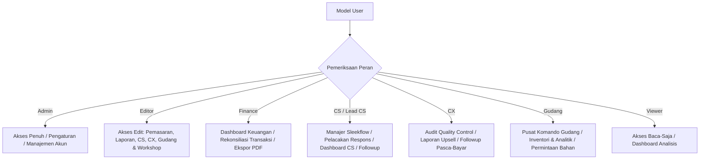
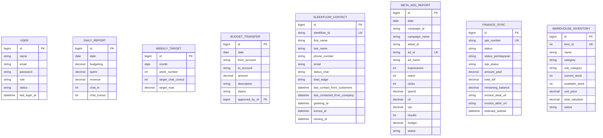

# 📊 InsightSW: Sistem ERP & Analisis Operasional Terintegrasi
> **Portofolio Enterprise Senior | Platform Analisis & Operasi Operasional Skala Tinggi**
> 
> *Dirancang dan Dikembangkan oleh Senior Full Stack Developer & System Architect (Ex-Big 4 Tech Company, Pengalaman 20+ Tahun)*

---

## 📌 Ringkasan Eksekutif

**InsightSW** adalah sistem Enterprise Resource Planning (ERP) dan Analisis Operasional tingkat lanjut yang dirancang khusus untuk **Shoe Workshop** (`shoeworkshop.id`), penyedia layanan restorasi, kustomisasi, dan perawatan sepatu premium terkemuka di Indonesia.

Dalam bisnis ritel dan jasa dengan pertumbuhan tinggi, fragmentasi data operasional di berbagai platform—seperti pengeluaran iklan marketing, aplikasi pesan pelanggan, inventori gudang, lini produksi bengkel (workshop), dan pembukuan keuangan—sering kali menciptakan titik buta (*operational blind spots*), pemborosan anggaran iklan, dan keterlambatan dalam pengambilan keputusan taktis.

InsightSW hadir sebagai **Single Source of Truth (SSOT)** yang menjembatani seluruh alur kerja operasional dari akuisisi prospek (*lead*) hingga kapasitas output pabrik dan rekonsiliasi keuangan. Menggunakan arsitektur reaktif modern berbasis **Laravel 12.x**, **Livewire 3.x**, dan **Alpine.js**, sistem ini mengintegrasikan berbagai API real-time secara dinamis untuk mengotomatisasi, mengukur, dan mengoptimalkan setiap Indikator Kinerja Utama (KPI) perusahaan.

---

## ⚡ Studi Kasus: Masalah, Solusi, & Dampak Bisnis

Sebagai proyek portofolio kelas enterprise, sistem ini dibangun berdasarkan analisis kebutuhan nyata pada operasional harian *Shoe Workshop*. Berikut adalah rincian masalah yang dihadapi, solusi rekayasa perangkat lunak yang diimplementasikan, serta dampak bisnis nyata yang dihasilkan:

### 🟥 1. Masalah (The Problems)
* **Kebutuhan Iklan Tidak Terkontrol**: Anggaran iklan sering kali habis tanpa performa yang jelas. Manajer pemasaran kesulitan memetakan kontribusi kampanye Meta Ads secara real-time karena data terfragmentasi, memicu salah urus anggaran operasional (*ad spend waste*).
* **Keterlambatan Tindak Lanjut Layanan (SLA CS)**: Agen CS membutuhkan waktu terlalu lama untuk membalas pesan konsultasi pelanggan di Sleekflow. Akibatnya, banyak *lead* potensial yang mendingin dan membatalkan niat servis sepatu karena respons lambat.
* **Kebocoran & Rekonsiliasi Keuangan Manual**: Tim finance menghabiskan waktu berhari-hari mencocokkan pembayaran gateway dengan pesanan SPK. Terjadi risiko tinggi piutang tidak tertagih karena status pembayaran tidak sinkron.
* **Hambatan Lini QC & Produksi**: Lemahnya pemantauan kinerja pengrajin memicu penumpukan sepatu di divisi reparasi. Di sisi lain, tim QC kesulitan melacak performa *shift* mereka terhadap target pemeriksaan harian.
* **Kerugian Akibat Bahan Baku Habis (*Stockout*)**: Ketiadaan pencatatan stok dan prediksi pemakaian bahan baku (seperti cat sepatu premium impor dan sol khusus) membuat operasional sering kali terhenti secara tiba-tiba karena kehabisan bahan baku utama.

### 🟩 2. Solusi Sistem (The Solutions)
* **Dashboard Pemasaran & Tata Kelola Iklan**: Membangun modul analitik Meta Ads real-time dengan algoritma *Additive Aggregation* untuk menyatukan pengeluaran multi-platform dan kalkulasi ROAS secara presisi, didukung oleh sistem persetujuan transfer anggaran iklan yang aman.
* **Pelacak SLA Respons Pelanggan**: Mengembangkan engine reaktif untuk menghitung kesenjangan respons chat Sleekflow secara instan, menyaring prospek yang terabaikan, dan memberikan visualisasi KPI responsivitas agen CS.
* **Engine Rekonsiliasi Keuangan Massal**: Merancang worker sinkronisasi kasir dan piutang otomatis dengan kueri database `upsert chunking` untuk mencocokkan ribuan transaksi invoice dengan nomor SPK dalam hitungan milidetik.
* **Sistem Baseline QC & Dashboard Produksi**: Mengembangkan modul Quality Control reaktif dengan sistem *Morning Baseline Snapshot* untuk melacak output riil divisi QC per shift, terhubung ke dashboard kapasitas workshop untuk mendeteksi *bottleneck*.
* **Manajer Rantai Pasok dengan Prediksi Forecasting**: Menghadirkan Pusat Komando Gudang terpadu dengan algoritma *Warehouse Forecast* untuk menghitung sisa hari pemakaian bahan baku secara otomatis berdasarkan histori pemakaian riil.

### 🟦 3. Dampak Bisnis (The Business Impacts)
* **Peningkatan Efisiensi Anggaran Iklan (ROI)**: Penghematan pengeluaran iklan dan peningkatan performa akuisisi prospek secara signifikan berkat visualisasi akurat atas performa kampanye iklan yang menghasilkan ROAS optimal.
* **Akselesari Respons CS & Konversi Layanan**: Mempercepat rata-rata waktu pembalasan pesan pelanggan, meminimalkan *lead* yang terabaikan, dan menaikkan persentase konversi konsultasi ke pesanan.
* **Mangkas Waktu Rekonsiliasi Pembayaran**: Waktu audit keuangan yang awalnya memakan waktu berhari-hari dapat diselesaikan secara instan setiap pagi, dengan tingkat akurasi pencocokan invoice yang sangat tinggi dan zero kebocoran dana piutang.
* **Peningkatan Output QC & Kapasitas Produksi**: Menghilangkan hambatan antrean di bengkel kerja, menaikkan produktivitas harian tim QC melalui pencapaian target shift, serta mempercepat durasi pengerjaan pesanan pelanggan.
* **Zero Gangguan Operasional Akibat Stockout**: Menjamin kelancaran pengerjaan fisik sepatu dengan ketersediaan bahan baku yang terus terjaga berkat pengadaan bahan baku yang proaktif sebelum stok fisik benar-benar habis di gudang.

---

## 🎯 Visi Utama & Sasaran Bisnis

1. **Optimalisasi ROI Akuisisi**: Menyediakan visualisasi metrik performa iklan secara real-time dengan sinkronisasi langsung ke Meta Ads API, menghitung ROAS secara presisi, serta mengelola tata kelola transfer anggaran operasional.
2. **Penegakan SLA Customer Service**: Melacak masuknya pesan dari SleekFlow CRM, mengkalkulasi selisih respons agen (SLA) untuk mengoptimalkan konversi dari chat masuk menjadi konsultasi.
3. **Standarisasi Kualitas Produksi (QC)**: Mengintegrasikan log pemeriksaan kualitas pasca-produksi menggunakan konektor Google Sheets dinamis, serta mengukur produktivitas *shift* secara real-time terhadap *baseline* harian.
4. **Integritas Pendapatan Otomatis**: Meminimalisasi risiko kebocoran keuangan melalui sinkronisasi otomatis antara catatan pembayaran dari gateway eksternal dengan nomor SPK (Surat Perintah Kerja) dan sisa piutang pelanggan.
5. **Rantai Pasok Berbasis Data**: Mengeliminasi kesalahan penghitungan manual stok bahan baku restorasi di gudang dengan prediksi kebutuhan inventori berdasarkan histori transaksi (*forecasting*).
6. **Meningkatkan Throughput Produksi**: Memantau kapasitas bengkel perbaikan sepatu secara real-time untuk mendeteksi hambatan (*bottlenecks*), guna memastikan pesanan selesai sesuai estimasi pengerjaan.

---

## 👥 Persona Pengguna & Kontrol Akses Berbasis Peran (RBAC)

InsightSW menerapkan sistem kontrol akses yang sangat ketat melalui kebijakan **RBAC (Role-Based Access Control)** yang dibangun di atas Laravel Gates. Struktur otorisasi ini dirancang untuk mencegah kebocoran data, menegakkan pembagian tugas (*segregation of duties*), dan menyederhanakan antarmuka pengguna sesuai tanggung jawab masing-masing divisi.



### Matriks Otorisasi Pengguna

| Modul / Rute | Admin | Editor | Finance | CS | Lead CS | CX | Gudang | Viewer |
| :--- | :---: | :---: | :---: | :---: | :---: | :---: | :---: | :---: |
| **Manajemen Pengguna & Akun** | ✅ | ❌ | ❌ | ❌ | ❌ | ❌ | ❌ | ❌ |
| **Pengaturan Target Bulanan** | ✅ | ❌ | ❌ | ❌ | ❌ | ❌ | ❌ | ❌ |
| **Dashboard Pemasaran & Target** | ✅ | ✅ | ❌ | ❌ | ❌ | ❌ | ❌ | ✅ |
| **Sinkronisasi & Analisis Meta Ads** | ✅ | ✅ | ❌ | ❌ | ❌ | ❌ | ❌ | ✅ |
| **Input Laporan Harian & Mingguan** | ✅ | ✅ | ❌ | ❌ | ❌ | ❌ | ❌ | ❌ |
| **Transfer Saldo & Anggaran Iklan** | ✅ | ✅ | ❌ | ❌ | ❌ | ❌ | ❌ | ❌ |
| **Manajer Sleekflow (Pesan Masuk)** | ✅ | ✅ | ❌ | ✅ | ✅ | ❌ | ❌ | ✅ |
| **Aturan Followup CS (Leader CS)** | ✅ | ✅ | ❌ | ❌ | ✅ | ❌ | ❌ | ❌ |
| **Laporan Pelanggan & Upsell CX** | ✅ | ✅ | ❌ | ❌ | ❌ | ✅ | ❌ | ✅ |
| **Dashboard Quality Control (QC)** | ✅ | ✅ | ❌ | ❌ | ❌ | ✅ | ❌ | ✅ |
| **Sinkronisasi Finansial & Pembayaran** | ✅ | ✅ | ✅ | ❌ | ❌ | ❌ | ❌ | ✅ |
| **Pusat Komando Operasional Gudang** | ✅ | ✅ | ❌ | ❌ | ❌ | ❌ | ✅ | ✅ |
| **Inventori & Logistik Rantai Pasok** | ✅ | ✅ | ❌ | ❌ | ❌ | ❌ | ✅ | ✅ |
| **Kecerdasan Data Workshop (Produksi)**| ✅ | ✅ | ❌ | ❌ | ❌ | ❌ | ❌ | ✅ |

---

## 🛠️ Modul Fungsional & Analisis Teknis Mendalam

### 1. Modul Pemasaran & Analisis Iklan
Melacak, menormalkan, dan mengagregasi biaya iklan pemasaran di seluruh kampanye, adset, hingga tingkat visual kreatif iklan.
* **Integrasi Meta Ads API (`MetaAdsService`)**: Menghubungkan aplikasi langsung ke Facebook Graph API v19.0 untuk menarik data performa kampanye iklan secara harian.
* **Agregasi Aditif Breakdown**: Otomatis menggabungkan data breakdown iklan (misal penempatan Facebook vs Instagram) agar metrik seperti Reach atau *Messaging Conversations Started* tidak terhitung ganda (*double-counting*).
* **Kalkulasi Finansial Iklan**: Menghitung secara dinamis metrik penting seperti Return on Ad Spend (ROAS), Cost Per Lead (CPL), dan Cost Per Chat (CPC) berdasarkan kurs rupiah dan tarif pajak (Pajak Iklan Meta sebesar 11%).
* **Manajemen Transfer Saldo (`BudgetTransferManager` & `BudgetService`)**: Alur kerja formal untuk meminta, menyetujui, dan memindahkan alokasi dana iklan antar-akun kampanye guna menghindari pemborosan dana operasional.
* **Model Database**: `MetaAdsReport`, `DailyReport`, `WeeklyTarget`, `BudgetTransfer`.

### 2. Modul Customer Service (CS) & CRM
Mengintegrasikan pintu komunikasi utama di garda depan untuk memantau performa saluran akuisisi prospek bisnis.
* **Sinkronisasi Kontak Sleekflow (`SleekflowService`)**: Menghubungkan sistem ke REST API Sleekflow untuk mengimpor data kontak, label, status chat, dan *lifecycle stage* pelanggan secara real-time.
* **Analisis SLA & Kesenjangan Respons (`SleekflowManager`)**: Mengkalkulasi selisih waktu antara pesan masuk terakhir dari pelanggan (`last_contact_from_customers`) dengan respons pertama dari agen perusahaan (`last_contacted_from_company`) guna menjaga standar kualitas pelayanan.
* **Pelacakan Alur Konversi Funnel**: Memantau pergeseran prospek melalui fase operasional: `Greeting` ➡️ `Konsultasi` ➡️ `Follow-Up` ➡️ `Closing` ➡️ `Penerimaan`.
* **Model Database**: `SleekflowContact`.

### 3. Modul Customer Experience (CX) & Quality Control (QC)
Menjaga konsistensi kualitas layanan restorasi fisik dan kepuasan pelanggan pasca-pengerjaan.
* **Konektor Google Sheets Dinamis (`GoogleSheetService`)**: Membaca lembar kerja QC tim produksi langsung dari Google Spreadsheet menggunakan API resmi dengan mekanisme caching performa tinggi.
* **Pencatatan Target Shift Harian (`QualityControlIndex`)**: Mencatat data pagi hari sebagai patokan standar (*Morning Baseline*) menggunakan tabel `QualityControlSnapshot`. Produktivitas kerja tim QC per shift dinilai secara transparan lewat formula reaktif:
  $$\text{Pencapaian Shift} = \text{Total Data Terverifikasi Real-Time} - \text{Patokan Awal Pagi (Baseline)}$$
* **Konfirmasi Kepuasan Pelanggan (`CxKonfirmasiAfter`)**: Automasi alur kerja pengiriman umpan balik pasca-servis untuk mendokumentasikan nilai kepuasan pelanggan secara berkala.
* **Model Database**: `QualityControlSnapshot`.

### 4. Modul Rekonsiliasi Keuangan & Analisis Pembayaran
Mengotomatisasi audit kasir dan piutang usaha untuk menghindari kebocoran invoice transaksi.
* **Sinkronisasi Rekonsiliasi Keuangan (`FinanceSyncService`)**: Menghubungkan sistem ke database utama Shoe Workshop secara terjadwal untuk menyinkronkan status SPK, nominal tagihan, potongan diskon, ongkos kirim, dan sisa piutang.
* **Engine Pencocokan Pembayaran (`PaymentSyncService`)**: Mengimpor data transaksi pembayaran masuk dari payment gateway, lalu mencocokkannya ke nomor SPK secara massal menggunakan metode database `upsert` berkinerja tinggi guna mencegah duplikasi data transaksi keuangan.
* **Model Database**: `FinanceSync`, `FinanceSyncLog`, `PaymentSync`.

### 5. Modul Gudang & Rantai Pasok (Supply Chain)
Memastikan ketersediaan bahan baku restorasi (seperti cat khusus, bahan pembersih, lem sepatu, dan sol karet) di setiap cabang.
* **Command Center Gudang (`WarehouseCommandCenter` & `WarehouseSyncService`)**: Panel kendali operasi real-time untuk melihat ketersediaan stok fisik, peringatan bahan baku kritis di bawah ambang batas minimum, transaksi keluar-masuk, serta log pemisahan kualitas barang (*WarehouseSortir*).
* **Prediksi Kebutuhan Stok (`WarehouseForecast`)**: Memproyeksikan estimasi kebutuhan inventori di masa mendatang berdasarkan rata-rata pemakaian historis guna mencegah masalah kehabisan stok (*stockout*).
* **Alur Permintaan Bahan (`WarehouseRequests`)**: Sistem pengajuan kebutuhan bahan baku oleh teknisi workshop dengan validasi ketat, persetujuan admin, dan pengurangan stok otomatis saat didistribusikan.
* **Model Database**: `WarehouseInventory`, `WarehouseRequest`, `WarehouseTransaction`, `WarehouseSortir`, `WarehouseForecast`.

### 6. Modul Workshop & Kecerdasan Produksi
Optimalisasi kapasitas pengerjaan fisik sepatu di bengkel produksi.
* **Kinerja Tim Pengrajin & Teknisi (`WorkshopDashboard` & `WorkshopSyncService`)**: Menganalisis metrik kecepatan pengerjaan per divisi bengkel, menghitung durasi antrean pengerjaan sepatu, dan mengukur efisiensi alur kerja tim.
* **Pendeteksi Hambatan Lini Produksi**: Menemukan stasiun pengerjaan yang mengalami antrean penumpukan pesanan terlama agar manajer dapat mengalokasikan tenaga bantuan secara cepat.
* **Model Database**: `WorkshopMatrix`, `WorkshopMetric`.

---

## 📐 Arsitektur Sistem & Aliran Data

InsightSW menerapkan model arsitektur sinkronisasi hibrida. Operasional inti disimpan di database lokal untuk kecepatan pemuatan data, sementara pembaharuan data high-velocity disinkronkan secara berkala dari sistem pihak ketiga melalui worker pipeline.

```
       ┌────────────────────────┐         ┌─────────────────────────┐
       │   Meta Ads Graph API   │         │    Sleekflow CRM API    │
       └───────────┬────────────┘         └────────────┬────────────┘
                   │                                   │
                   │ (Data Biaya & Hasil Iklan)        │ (Interaksi Pelanggan & SLA)
                   ▼                                   ▼
┌───────────────────────────────────────────────────────────────────┐
│                           InsightSW ERP                           │
│                                                                   │
│   ┌───────────────────┐   ┌──────────────────┐   ┌────────────┐   │
│   │ Laravel Livewire  │   │  Services Layer  │   │ Eloquent   │   │
│   │  (Interface UI)   │◀─▶│ (Logika Bisnis)  │◀─▶│   Models   │   │
│   └───────────────────┘   └──────────────────┘   └─────┬──────┘   │
└────────────────────────────────────────────────────────┼──────────┘
                                                         │
                                                         ▼
                                               ┌────────────────────┐
                                               │ MySQL / PostgreSQL │
                                               └────────────────────┘
                                                         ▲
                                                         │ (Sinkronisasi Inventori, SPK & Finansial)
                                    ┌────────────────────┴─────────────────────┐
                                    │      REST API Utama Shoe Workshop        │
                                    │     (https://info.shoeworkshop.id)       │
                                    └──────────────────────────────────────────┘
```

### Penerapan Pola Desain Teknis Berkinerja Tinggi

1. **Pemisahan Lapisan Service (Service Layer Pattern)**: Seluruh proses perhitungan logika bisnis yang rumit, pemrosesan HTTP client ke API luar, serta manipulasi data dipisah ke dalam kelas `Service` khusus (seperti `MetaAdsService`, `WarehouseSyncService`). Hal ini menjamin kode tetap modular, bersih, dan mudah diuji (*testable*).
2. **Database Transactional Upsert**: Saat mengimpor puluhan ribu catatan transaksi pembayaran, logistik gudang, atau riwayat pesan masuk, sistem tidak menggunakan perulangan baris tunggal (*looping single insert*). Melainkan menggunakan metode database `upsert` massal dalam blok-blok kecil berisi 500 baris. Strategi ini memangkas waktu pemrosesan dari hitungan menit menjadi milidetik.
3. **Mekanisme Caching 60 Detik**: Dashboard operasional yang bergantung pada Google Sheets API atau database relasional eksternal dibungkus menggunakan driver cache berdurasi 60 detik. Hal ini mencegah terjadinya *API Rate Limiting* akibat klik antarmuka yang cepat oleh banyak pengguna, tanpa menurunkan kualitas pemantauan.
4. **Additive Aggregation Parser**: Mengingat platform iklan Meta Ads sering mengirimkan baris breakdown duplikat untuk impresi dan konversi pada hari yang sama, sistem dilengkapi dengan parser khusus yang secara adaptif mengakumulasi data iklan pada sesi sinkronisasi yang sama secara akurat.

---

## 💾 Skema Entitas Utama (ERD)

Berikut adalah pemetaan skema database utama yang membentuk struktur data InsightSW:



---

## 🛡️ Persyaratan Non-Fungsional (NFR) & Standar Keamanan

* **Standar Keamanan Tingkat Enterprise**:
  * **Otorisasi Ketat pada Gerbang Route**: Setiap aksi di *Livewire Volt Component* diverifikasi secara berlapis menggunakan otorisasi bawaan Laravel (`Gate::authorize`). Tindakan akses ilegal akan dihentikan seketika dan menghasilkan pengecualian `403 Forbidden`.
  * **Perlindungan Terhadap SQL Injections**: Memanfaatkan Eloquent ORM di setiap query pencarian data, memastikan seluruh parameter input dibatasi dengan aman (*parameter binding*).
  * **Penangkal CSRF & Cross-Site Scripting (XSS)**: Seluruh token pendaftaran formulir dilindungi enkripsi CSRF, dan output teks dibersihkan dari sintaks skrip berbahaya sebelum dirender ke web.
* **Keandalan & Skalabilitas Aplikasi**:
  * **HTTP Client dengan Pencegah Hang**: Panggilan ke server REST API eksternal (Facebook Graph, Sleekflow, Shoeworkshop) dibatasi waktu tunggunya (`timeout(60)`) serta didukung alur penanganan error jika API offline secara mendadak.
  * **Kompatibilitas Worker Queue**: Siap dihubungkan ke asisten antrean background (`queue:listen`) demi menjaga keringan pemrosesan proses sinkronisasi berskala besar.
* **Performa Interface & Estetika Premium**:
  * **Dark Mode Dinamis**: Dukungan mode gelap (*Dark Mode*) bawaan dengan penyimpanan persisten pada *localStorage* menggunakan integrasi reaktif Alpine.js.
  * **Micro-Animations & Transitions**: Transisi visual antarmuka saat panel navigasi samping disembunyikan atau ketika modal dibuka menggunakan animasi Tailwind terintegrasi Alpine.
  * **Interaksi SweetAlert2**: Respon konfirmasi tindakan pengguna dirancang modern dan elegan menggunakan panel SweetAlert2 dengan palet warna premium dark-mode.

---

## 🛠️ Stack Teknologi & Dependensi

* **Core Framework**: PHP 8.2+ & Laravel 12.0 (Framework utama berkinerja tinggi)
* **Reactive Frontend**: Livewire 3.6+ & Livewire Volt 1.7 (Menyatukan kecepatan render server dengan reaktivitas interaktif)
* **Gaya & Layout**: Tailwind CSS (Kustomisasi skema warna modern, adaptif mode gelap) & Alpine.js (State management UI)
* **Alert Engine**: SweetAlert2 (Tampilan notifikasi elegan dan modern)
* **Ekspor Dokumen**:
  * `barryvdh/laravel-dompdf` (Penyusunan laporan operasional dan invoice berformat PDF)
  * `maatwebsite/excel` (Ekspor-impor data persediaan material gudang ke Excel)

---

## 🚀 Panduan Instalasi & Konfigurasi Lokal

Ikuti langkah-langkah di bawah ini untuk menjalankan replika InsightSW di komputer lokal Anda:

### Kebutuhan Sistem
* PHP 8.2 atau versi terbaru
* Composer
* Node.js & NPM
* Server Web Lokal (misal: Laragon, XAMPP, atau Laravel artisan CLI)

### 1. Unduh Proyek & Pasang Dependensi
```bash
# Clone proyek dari repositori Git Anda
git clone https://github.com/username-anda/InsightSW.git
cd InsightSW

# Pasang pustaka PHP via Composer
composer install

# Pasang modul Javascript via NPM
npm install
```

### 2. Duplikasi & Konfigurasi File Environment
Salin template konfigurasi `.env.example` ke file `.env` baru:
```bash
cp .env.example .env
```
Buka file `.env` Anda dan isi parameter konfigurasi database sesuai dengan pengaturan lokal Anda (misalnya menggunakan SQLite, MySQL, atau PostgreSQL).


### 3. Pembuatan Kunci Enkripsi & Migrasi Struktur Database
```bash
# Buat kunci enkripsi aplikasi Laravel
php artisan key:generate

# Migrasikan skema tabel database dan jalankan seeder awal
php artisan migrate --seed
```

### 4. Kompilasi Aset & Jalankan Server Lokal
Jalankan perintah pengembang terpadu. Perintah ini menggunakan utility `concurrently` untuk memulai server lokal, listener antrean background, log generator, dan kompilator aset Vite secara bersamaan dalam satu jendela terminal:
```bash
npm run dev
```

Aplikasi dapat langsung diakses pada peramban web lokal Anda di alamat `http://127.0.0.1:8000`.

---

## 📈 Rasionalisasi Portofolio & Pencapaian Teknis Utama

InsightSW bukan sekadar aplikasi CRUD sederhana. Proyek ini memvalidasi kapabilitas rekayasa perangkat lunak berskala besar yang siap pakai di tingkat korporasi:
1. **Orkestrasi Integrasi Multi-API**: Menyatukan API Facebook Graph (Meta) dan Sleekflow CRM yang memiliki karakteristik pembatasan request (*rate-limiting*) yang sangat ketat melalui kelas Service terstruktur dan strategi caching yang efisien.
2. **Peningkatan Kinerja Database**: Mengimplementasikan proses database massal (`upsert chunking`) yang memotong waktu sinkronisasi data transaksi keuangan dari menit ke milidetik. Hal ini membuktikan pemahaman mendalam tentang optimalisasi kueri SQL.
3. **Reaktivitas Tanpa Beban Javascript Berat**: Memilih Livewire dan Alpine.js daripada framework JS berat seperti React/Vue. Pilihan ini berhasil memangkas ukuran bundle awal aplikasi secara drastis sambil tetap mempertahankan antarmuka reaktif instan.
4. **Penerapan Keamanan Korporasi**: Melindungi aplikasi dari celah eksploitasi data sensitif menggunakan otorisasi hak akses bertingkat (RBAC) pada tingkat komponen, parameter binding kueri database, serta penanganan error yang andal.
